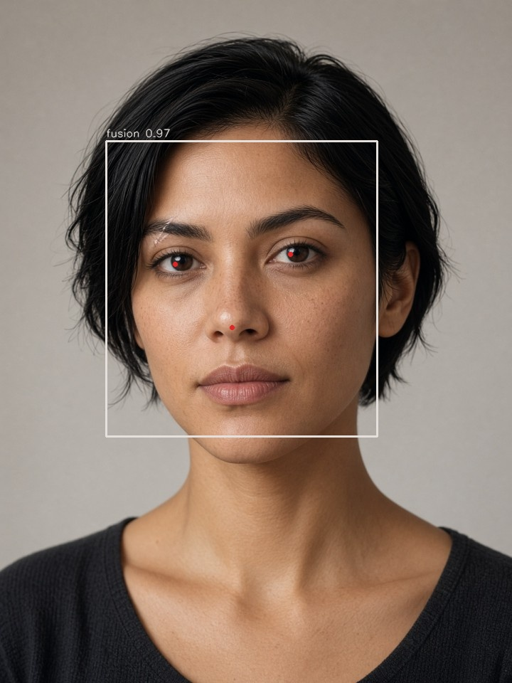
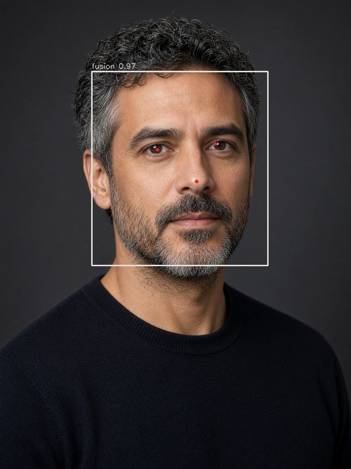
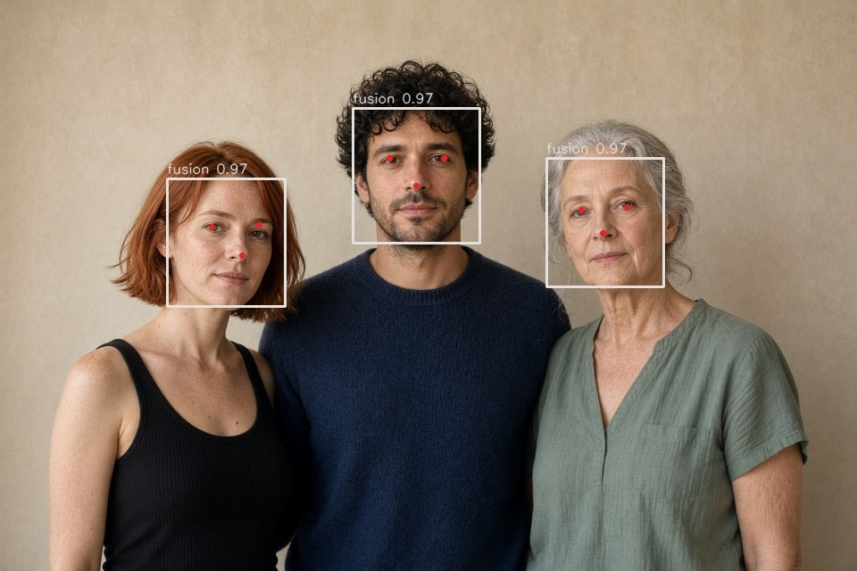

# VISAGE

Graduate computer-vision laboratory: multi-cue face **detection**, **alignment**, **tracking**, and **recognition**.

This is not a one-file Haar demo. The classical pieces are implemented and tested here. OpenCV is used where a published model is the right baseline, and the report says which is which.

```
image
  ├─ Haar cascades (OpenCV, both profile directions)
  ├─ YuNet landmarks and score
  ├─ skin-ratio gate on the classical boxes only
  └─ weighted box fusion
        ├─ similarity alignment from the eyes
        ├─ blur / exposure / roll quality
        ├─ optional SFace embedding
        └─ SORT tracker across frames
```

Separately, and from scratch: integral images, Haar-like features, discrete AdaBoost, HOG + linear SVM, eigenfaces, Fisherfaces, uniform LBPH.

## Setup

Python 3.10+. **Pin OpenCV 4.10.** The 5.0 wheel drops `cv2.CascadeClassifier`, which removes Viola–Jones entirely.

```bash
python -m venv .venv && source .venv/bin/activate
pip install -r requirements.txt
python -m unittest tests.test_core -v
python -m visage.bench          # writes results/bench.json
python -m visage detect samples/three.jpg -o results/three.jpg
python -m visage track clip.mp4 -o results/tracked.mp4
```

YuNet and SFace weights download into `models/` on first use (~37 MB for SFace). See [models/README.md](models/README.md). Haar cascades ship inside the OpenCV wheel.

## What is reimplemented

| Piece | Where | Notes |
| --- | --- | --- |
| Integral image, rectangle sum, window σ | `visage/integral.py` | Crow 1984, as used by Viola–Jones |
| Haar-like features (2-, 3-, 4-rectangle) | `visage/haar.py` | Area-normalized, variance-normalized |
| Discrete AdaBoost stumps | `visage/adaboost.py` | The learner, not a bootstrapped attentional cascade |
| Sliding window | `visage/scan.py` | Single scale, same window the stumps were trained on |
| HOG, 9-bin, L2-Hys blocks | `visage/hog.py` | Dalal & Triggs |
| Skin predicate + components | `visage/skin.py` | Kovac RGB ∧ YCrCb box |
| Eigenfaces / Fisherfaces / uniform LBPH | `eigenfaces.py`, `fisherfaces.py`, `lbph.py` | Nearest neighbor |
| SORT | `visage/tracker.py` | Kalman + Hungarian IoU, no appearance |
| VOC average precision | `visage/evaluate.py` | All-point interpolation |
| Cascades, YuNet, SFace | `detectors.py`, `sface.py` | Published weights, not trained here |
| Fusion, eye alignment, quality | `pipeline.py`, `align.py`, `quality.py` | The system under test |

The math and the things this system refuses to claim are in [THEORY.md](THEORY.md). A walkthrough of one pass, and of what the viewer recomputes, is in [HOW.md](HOW.md).

## Results

From `python -m visage.bench` (seeded). Full dump: [results/bench.json](results/bench.json).

### Classical stack, synthetic

The renderer is deliberately separable. These numbers check the implementation. They are not an LFW score.

| Experiment | Result |
| --- | --- |
| AdaBoost, 64 Haar features, 10 rounds, held-out accuracy | **0.990** |
| Planted 24×24 face, sliding window, best IoU | **1.00** |
| Same image, AP at IoU 0.5 | **1.00** (one detection) |
| Face score minus blank-field score | **+24.9** |
| HOG + linear SVM, held-out accuracy | **1.000** |
| HOG descriptor length at 64×64 | 1764 |
| Vertical step edge, dominant bin | bin 0 (0°) |
| Eigenfaces / Fisherfaces / LBPH rank-1, 6 identities, 12 test images | **1.00 / 1.00 / 1.00** |
| SORT, constant velocity, 20 frames then a one-frame gap | id held |

### Plates

Fictional studio photographs in `samples/`. Fusion of the frontal cascades, both profile orientations, and YuNet. A classical box that never joins a cluster and scores under 0.55 is dropped: on the group plate that rule removes a profile-cascade hit on hair, and it would also drop a true profile that no other detector supports.

| Plate | Faces | Time |
| --- | --- | --- |
| `charcoal.jpg` | 1 | 0.77 s |
| `north-light.jpg` | 1 | 0.63 s |
| `three.jpg` | 3 | 0.60 s |







Fusion scores on these plates sit at 0.97. Skin ratio inside the box is reported, not used as a detector. The center box on the group plate sits high (chin clipped). That is the fusion of a square Haar window with YuNet, not a hidden success.

### Photographs

Twelve real photographs live in `samples/photographs/` and are not part of the SFace pair table above. The same fusion was run on each. Counts are detector output, not ground truth. Plate N (sun hat, profile, sunglasses) fuses to nothing. Plate D keeps a box on the table. Plate E keeps a box on foliage. Credits are in [samples/photographs/ATTRIBUTION.md](samples/photographs/ATTRIBUTION.md).

| File | Fused faces |
| --- | --- |
| `nasa-class.jpg` | 10 |
| `market-shade.jpg` | 3 |
| `kondh.jpg` | 2 |
| `in-the-crowd.jpg` | 1 |
| `pipe.jpg` | 1 |
| `occluded-pair.jpg` | 1 |
| `sunglasses.jpg` | 1 |
| `wellcome.jpg` | 1 |
| `aviator.jpg` | 1 |
| `fedora.jpg` | 1 |
| `sun-hat.jpg` | 0 |
| `terrace.jpg` | 1 |

### SFace verification

Photometric copies (gamma 0.7, gamma 1.5, blur, JPEG q=35), matched back to the same face by IoU so the group plate does not pair one person with another. Impostors are every other pair of faces across the three plates.

| | n | min | mean | max |
| --- | --- | --- | --- | --- |
| Genuine cosine | 20 | 0.911 | 0.956 | 0.992 |
| Impostor cosine | 10 | 0.249 | 0.382 | 0.552 |

The OpenCV Zoo cosine threshold is **0.363**. On this set every genuine pair clears it (TAR 1.00) and **6 of 10 impostors also clear it (FAR 0.60)**. A threshold of 0.70 separates these 30 pairs, and that sentence is only about these 30 pairs: five fictional faces, one generator, no held-out population. Do not quote 0.70 as an operating point.

## Layout

```
visage/            library
tests/test_core.py unit tests, no network
samples/           three studio plates
samples/photographs/  twelve photographs, with attribution
results/           bench.json and annotated plates
THEORY.md          the write-up
```

## References

1. Viola, Jones. Rapid object detection using a boosted cascade of simple features. CVPR 2001.
2. Dalal, Triggs. Histograms of oriented gradients for human detection. CVPR 2005.
3. Turk, Pentland. Eigenfaces for recognition. Journal of Cognitive Neuroscience, 1991.
4. Belhumeur, Hespanha, Kriegman. Eigenfaces vs. Fisherfaces. PAMI 1997.
5. Ojala, Pietikäinen, Mäenpää. Multiresolution gray-scale and rotation invariant texture classification with local binary patterns. PAMI 2002.
6. Bewley, Ge, Ott, Ramos, Upcroft. Simple online and realtime tracking. ICIP 2016.
7. Wu, Peng, Yu. YuNet: a tiny millisecond-level face detector. OpenCV Zoo, 2023.
8. Zhong, Zhu, Liu, et al. SFace: sigmoid-constrained hypersphere loss for robust face recognition. 2021.
9. Kovac, Peer, Solina. Human skin colour clustering for face detection. EUROCON 2003.
10. Buolamwini, Gebru. Gender Shades. FAT* 2018.

## Limits

Face recognition is a surveillance technology. This repository is coursework. It does not enroll anyone but the images you pass it, it does not phone home, and the skin model is a known source of bias across skin tones. Read the last section of [THEORY.md](THEORY.md) before pointing it at a camera that is not yours.
